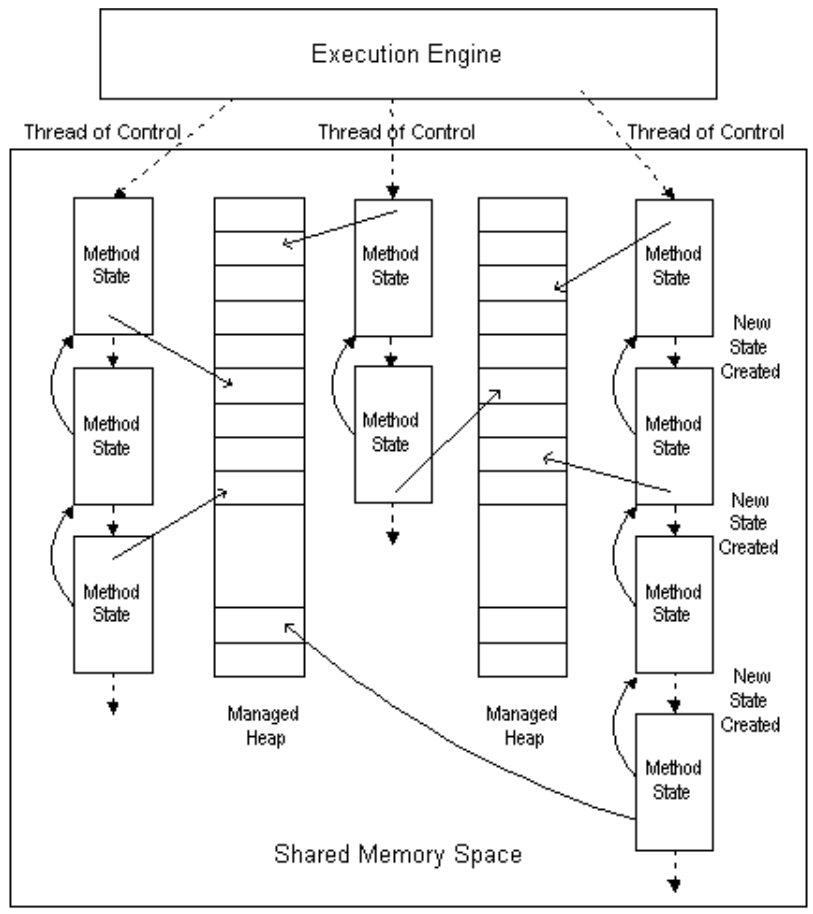
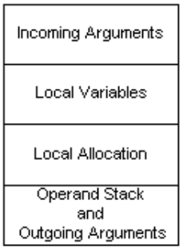

## I.12.3.1 The global state

The CLI manages multiple concurrent threads of control (not necessarily the same as the threads provided by a host operating system), multiple managed heaps, and a shared memory address space.

_[Note:_ A thread of control can be thought of, somewhat simplistically, as a singly linked list of *method states*, where a new state is created and linked back to the current state by a method call instruction&mdash;the traditional model of a stack-based calling sequence. Notice that this model of the thread of control doesn’t correctly explain the operation of `tail.`, `jmp`, or `throw` instructions. _end note]_

[Figure 2: Machine State Model](#todo-missing-hyperlink) illustrates the machine state model, which includes threads of control, method states, and multiple heaps in a shared address space. Method state, shown separately in [Figure 3: Method State](#todo-missing-hyperlink), is an abstraction of the stack frame. Arguments and local variables are part of the method state, but they can contain Object References that refer to data stored in any of the managed heaps. In general, arguments and local variables are only visible to the executing thread, while instance and static fields and array elements can be visible to multiple threads, and modification of such values is considered a side-effect.

#### Figure 2: Machine State Model

 

#### Figure 3: Method State

 
