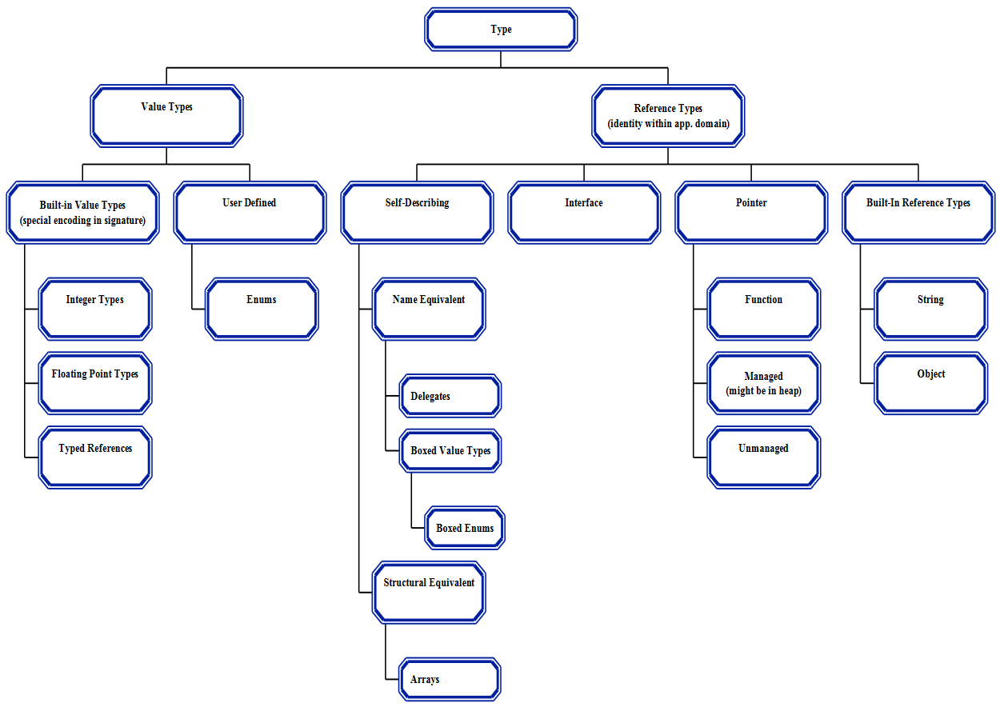

## I.8 Common Type System

Types describe values and specify a contract (see §[I.8.6](i.8.6-contracts.md)) that all values of that type shall support. Because the CTS supports Object-Oriented Programming (OOP) as well as functional and procedural programming languages, it deals with two kinds of entities: objects and values. **Values** are simple bit patterns for things like integers and floats; each value has a type that describes both the storage that it occupies and the meanings of the bits in its representation, and also the operations that can be performed on that representation. Values are intended for representing the corresponding simple types in programming languages like C, and also for representing non-objects in languages like C++ and Java&trade;.

**Objects** have rather more to them than do values. Each object is self-typing, that is, its type is explicitly stored in its representation. It has an identity that distinguishes it from all other objects, and it has slots that store other entities (which can be either objects or values). While the contents of its slots can be changed, the identity of an object never changes.

There are several kinds of objects and values, as shown in the (informative) diagram below.

The generics feature allows a whole family of types and methods to be defined using a pattern, which includes placeholders called *generic parameters*. These generic parameters are replaced, as required, by specific types, to instantiate whichever member of the family is actually required. The design of generics meets the following goals:

 * Orthogonality: Where possible, generic types can occur in any context where existing CLI types can occur.

 * Language independence: No assumptions about the source language are made. But CLI-generics attempts to support existing generics-like features of as many languages as possible. Furthermore, the design permits clean extensions of languages currently lacking generics.

 * Implementation independence: An implementation of the CLI is allowed to specialize representations and code on a case-by-case basis, or to share all representations and code, perhaps boxing and unboxing values to achieve this.

 * Implementation efficiency: Performance of generics is no worse than the use of Object to simulate generics; a good implementation can do much better, avoiding casts on reference type instantiations, and producing specialized code for value type instantiations.

 * Statically checkable at point of definition: A generic type definition can be validated and verified independently of its instantiations. Thus, a generic type is statically verifiable, and its methods are guaranteed to JIT-compile for all valid instantiations.

 * Uniform behavior with respect to generic parameters: In general, the behavior of parameterized types and generic methods is "the same" at all type instantiations.

In addition, CLI supports covariant and contravariant generic parameters, with the following characteristics:

 * It is type-safe (based on purely static checking)

 * Simplicity: in particular, variance is only permitted on generic interfaces and generic delegates (not classes or value-types)

 * Variance affects call instructions that invoke a method from a variant interface. For nonvariant interfaces, a method of the exact type specified in the call instruction must exist, and is invoked. For variant interfaces, a method of the exact type specified in the call instruction need not exist; only one that is a variant match for the type. Furthermore, if multiple matches exist, the declaration order and derivation of the methods determine which one is called, and a variant match may be invoked even if an exact match exists ([II.12.2](ii.12.2-implementing-virtual-methods-on-interfaces.md)). All language systems targeting the CLI must take into account variance whether or not the source language supports the feature.

 * Enable implementation of more complex covariance scheme as used in some languages, e.g. Eiffel.

> _This figure is informative._

#### Figure 1: Type System

 

_[Note:_ A managed pointer might point into the heap. _end note]_

> _End informative figure._
