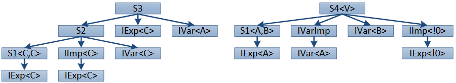

## II.12.2.1 Interface Implementation Examples

> _This subclause contains only informative text._

These examples illustrate the application of the rules for resolving interface calls. The examples use an abbreviated form of the ilasm syntax (e.g. `I<T>` instead of ``I`1<T>`` and '`:`' as an abbreviation for extends or implements), and the **inheritance/implements tree** diagrams omit `System.Object`.

Here are the interfaces used:

 ```ilasm
 IExp<T> { void M() {} }       // Interface which declares method M
 IImp<T> : IExp<T> {}          // Interface requiring IExp<T>
 IVar<-T> { void P(T) {} }     // Contravariant interface with method P
 IVarImp : IVar<A> {}          // Implicit variant interface 
 ```

The following simple types are used as generic type arguments (and for conciseness, an instantiation such as `I<class A>` is abbreviated as `I<A>`, so the reader should note that `A`, `B` and `C` are actual types, not type parameters):

 ```ilasm
 A {}
 B : A {}
 C : B {}
 ```

The following types are used to illustrate the implementation of interfaces:

 ```ilasm
 abstract S1<T,U> : IExp<!0> {
   void MImpl() {.override IExp<!0>::M()...}
   void P(!0){...}
   void P(!1){...}
 }
 S2 : S1<C,C>, IImp<C>, IVar<C> {
   void M(){...}
 }
 S3 : S2, IExp<C>, IVar<A> {
   void M(){...}
   newslot void P(A){...}
 }
 S4<V> : S1<A,B>, IVarImp, IVar<B>, IImp<!0> {
   newslot void M(){...}
 }
 ```

**Explicit interfaces**: The explicit interfaces of a type are those directly listed in its implements list (e.g. for `S2` it is only `IImp<A>` and `IVar<C>`, not `IExp<A>`, although it is required by `IImp<A>`, and implicitly implemented through parent type `S1<C,C>`).

**Inherits/implements trees**: Here are the inherits/implements trees for `S3` and `S4` (as it happens, in this example the tree for `S2` is a proper subset of the tree for `S3`): 

 

**Type declaration order**: The type declaration order for types `S2`, `S3` and `S4` is as follows:

    S2    : IExp<C>, S1<C,C>, IImp<C>, IVar<C>, S2
    S3    : IExp<C>, S1<C,C>, IImp<C>, IVar<C>, S2, IVar<A>, S3
    S4<V> : IExp<A>, S1<A,B>, IVar<A>, IVarImp, IVar<B>, IExp<!0>, IImp<!0>, S4<!0>

`IExp<C>` appears only once in the type declaration order for `S3`, even though it appears in the tree below `IImp<C>`. This is because the second occurrence is a duplicate. However, `IExp<!0>` appears in the `S4<V>` inherits/implements tree because it is not a duplicate of `IExp<A>`.

**Method declaration order**: The method declaration order for these types is as follows:

    S1<T,U>: S1<!0,!1>::MImpl(), S1<!0,!1>::P(!0), S1<!0,!1>::P(!1)
    S2     : S1<C,C>::MImpl(), S1<C,C>::P(!0:C), S1<C,C>::P(!1:C), S2::M()
    S3     : S1<C,C>::MImpl(), S1<C,C>::P(!0:C), S1<C,C>::P(!1:C), S3::M(),S3::P(A)
    S4<V>  : S1<A,B>::MImpl(), S1<A,B>::P(A), S1<A,B>::P(B), S4<!0>::M()

Note that the newslot methods appear separately in the lists, while overrides replace the overridden method in the list. The lists above are shown with the generic parameter substitution as declared by the extending or implementing type, but using the `!n` notation to identify the original type parameter from the defining type where it is ambiguous (e.g. `S1<C,C>::P(!0:C)` refers to the first `P` method in `S1`, in which the first type parameter is bound to type `C`). 

The interface tables are as follows: 

 Class | Interface Method | Implementation List
 ---- | ---- | ----
 `S1<T,U>` | `IExp<T>::M()` | `(IExp<!0>)S1<!0,!1>::MImpl()`
 `S2` | `IVar<T>::P(T)` | `(IVar<C>)S1<C,C>::P(!1:C)`
 `S3` | `IExp<T>::M()` | `(IExp<C>)S3::M()`
 &nbsp; | `IVar<T>::P(T)` | `(IVar<A>)S3::P(A)`
 `S4<V>` | `IExp<T>::M()` | `(IExp<!0>)S4<!0>::M()`
 &nbsp; | `IVar<T>::P(T)` | `(IVar<A>)S1<A,B>::P(!0:A)`<br>`(IVar<B>)S1<A,B>::P(!1:B)`

Following are several code sequences illustrating different interesting cases. These sequences assume that `a`, `c`, `s2`, `s3` and `s4` are indices of local variables of type `A`, `C`, `S2`, `S3` and `S4<A>`, respectively.

#### Case 1: Implicit implementation

 ```ilasm
 ldloc      s2
 callvirt   IExp<C>::M()  // 1: Calls S1<!0,!1>::MImpl()
 ```

Although `S2` provides a matching method for `IExp<C>::M()`, it is not added to the implementation list because `IExp<C>` is not an explicit interface of `S2`, and there is already a match provided by the parent type, `S1<C,C>`.

#### Case 2: Explicit implementation

 ```ilasm
 ldloc      s3
 callvirt   IExp<C>::M()  // 2: Calls S3::M()
 ```

The situation is different for `S3` because `IExp<C>` is an explicit interface of `S3`, so its matching `M()` method is added to the implementation list.

#### Case 3: Implicit implementation with differing type parameters

 ```ilasm
 ldloc      s4
 callvirt   IExp<A>::M()  // 3: Calls S4<A>::M()
 ```

`S4<V>` is a slightly different case. While it implements `IExp<!0>` only implicitly, it differs in type parameters from the `IExp<A>` implemented by its parent (i.e., the parent instantiation is fixed as `IExp<A>`, while the implicit implementation is unbound as `IExp<!0>`). So its matching `M()` is added to the list, and is invoked even when `S4` is instantiated with the matching type parameter of the explicit parent implementation, since the interface table is constructed from the open type.

#### Case 4: Duplicate methods after instantiation (method order)

 ```ilasm
 ldloc      s2
 ldloc      c
 callvirt   IVar<C>::P(C) // 4: Calls S1<C,C>::P(!1:C)
 ```

The two `P` methods on `S1<C,C>` both match `IVar<C>::P(C)`. The last matching method is kept (bullet 4 of the table building algorithm).

#### Case 5: Variant match vs. exact match on parent

 ```ilasm
 ldloc      s3
 ldloc      c
 callvirt   IVar<C>::P(C) // 5: Calls S3::P(A)
 ```

Although `S3::P(A)` is a match through variance for `IVar<C>::P(C)`, `S2<A,B::IVar<A>::P(A)` on its parent is an exact match. However, the variant match is found before searching the parent type.

#### Case 6: Interface declaration order

 ```ilasm
 ldloc      s4
 ldloc      c
 callvirt   IVar<C>::P(C) // 6: Calls S1<A,B>::P(!0:A)
 ```

Although `IVar<A>` is not an explicit interface of `S4<A>`, it is placed ahead of `IVar<B>` in the interface order. This is why the call resolves to `S1<A,B>::P(!0:A)`, instead of `S1<A,B>::P(!1:B)`. (Note that this is independent of the type parameter of `S4<V>`, which only affects the `IImp<!0>` interface implementation).

> _End informative text._
