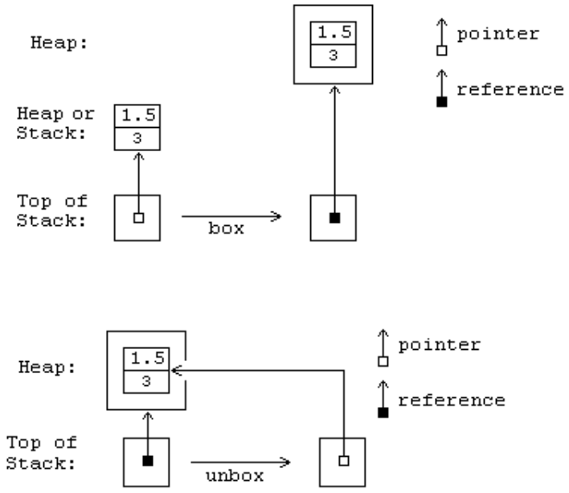

## II.13.3 Methods of value types

Value types can have static, instance and virtual methods. Static methods of value types are defined and called the same way as static methods of class types. As with classes, both instance and virtual methods of a boxed or unboxed value type can be called using the `call` instruction. The `callvirt` instruction shall not be used with unboxed value types (see [Partition I](#todo-missing-hyperlink)), but it can be used on boxed value types.

Instance and virtual methods of classes shall be coded to expect a reference to an instance of the class as the *this* pointer. By contrast, instance and virtual methods of value types shall be coded to expect a managed pointer (see [Partition I](#todo-missing-hyperlink)) to an unboxed instance of the value type. The CLI shall convert a boxed value type into a managed pointer to the unboxed value type when a boxed value type is passed as the *this* pointer to a virtual method whose implementation is provided by the unboxed value type.

_[Note:_ This operation is the same as unboxing the instance, since the `unbox` instruction (see [Partition III](#todo-missing-hyperlink)) is defined to return a managed pointer to the value type that shares memory with the original boxed instance. The following diagrams are intended to help the reader understand the relationship between the boxed and unboxed representations of a value type.

 

_end note]_

_[Rationale:_ An important use of instance methods on value types is to change internal state of the instance. This cannot be done if an instance of the unboxed value type is used for the this pointer, since it would be operating on a copy of the value, not the original value: unboxed value types are copied when they are passed as arguments. Virtual methods are used to allow multiple types to share implementation code, and this requires that all classes that implement the virtual method share a common representation defined by the class that first introduces the method.  Since value types can (and in the Base Class Library do) implement interfaces and virtual methods defined on `System.Object`, it is important that the virtual method be callable using a boxed value type so  it can be manipulated as would any other type that implements the interface. This leads to the requirement that the EE automatically unbox value types on virtual calls. _end rationale]_

#### Table II.2: Type of this given the CIL instruction and the declaring type of instance method.

 &nbsp; | Value Type (Boxed or Unboxed) | Interface | Object Type
 ---- | ---- | ---- | ----
 `call` | managed pointer to value type | invalid | object reference
 `callvirt` |  managed pointer to value type | object reference | object reference

_[Example:_

The following converts an integer of the value type `int32` into a string. Recall that `int32` corresponds to the unboxed value type `System.Int32` defined in the Base Class Library.  Suppose the integer is declared as:

 ```ilasm
 .locals init (int32 x)
 ```

Then the call is made as shown below:

 ```ilasm
 ldloca x  // load managed pointer to local variable
 call instance string valuetype [mscorlib]System.Int32::ToString()
 ```

However, if `System.Object` (a class) is used as the type reference rather than `System.Int32` (a value type), the value of `x` shall be boxed before the call is made and the code becomes:

 ```ilasm
 ldloc x
 box valuetype [mscorlib]System.Int32
 callvirt instance string [mscorlib]System.Object::ToString()
 ```

_end example]_
