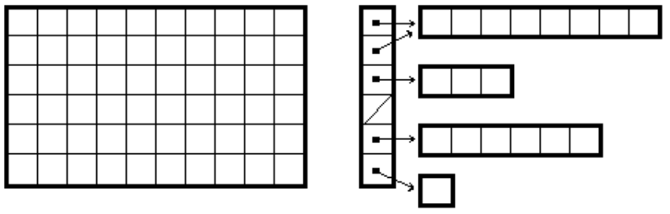

## II.14.2 Arrays

While vectors (§[II.14.1](ii.14.1-vectors.md)) have direct support through CIL instructions, all other arrays are supported by the VES by creating subtypes of the abstract class `System.Array` (see [Partition IV](#todo-missing-hyperlink))

 | _Type_ ::=
 | ----
 | &hellip;
 | \| _Type_ `'['` [ _Bound_ [ `','` _Bound_ ]*] `']'`

The *rank* of an array is the number of dimensions. The CLI does not support arrays with rank 0. The type of an array (other than a vector) shall be determined by the type of its elements and the number of dimensions.

 | _Bound_ ::= | Description
 | ---- | ----
 | `'...'` | Lower and upper bounds unspecified. In the case of multi-dimensional arrays, the ellipsis can be omitted
 | \| _Int32_ | Zero lower bound, _Int32_ upper bound
 | \| _Int32_ `'...'` | Lower bound only specified
 | \| _Int32_ `'...'` _Int32_ | Both bounds specified

The class that the VES creates for arrays contains several methods whose implementation is supplied by the VES:

 * A constructor that takes a sequence of `int32` arguments, one for each dimension of the array, that specify the number of elements in each dimension beginning with the first dimension. A lower bound of zero is assumed.

 * A constructor that takes twice as many `int32` arguments as there are dimensions of the array. These arguments occur in pairs&mdash;one pair per dimension&mdash;with the first argument of each pair specifying the lower bound for that dimension, and the second argument specifying the total number of elements in that dimension. Note that vectors are not created with this constructor, since a zero lower bound is assumed for vectors.

 * A `Get` method that takes a sequence of `int32` arguments, one for each dimension of the array, and returns a value whose type is the element type of the array. This method is used to access a specific element of the array where the arguments specify the index into each dimension, beginning with the first, of the element to be returned.

 * A `Set` method that takes a sequence of `int32` arguments, one for each dimension of the array, followed by a value whose type is the element type of the array. The return type of `Set` is `void`. This method is used to set a specific element of the array where the arguments specify the index into each dimension, beginning with the first, of the element to be set and the final argument specifies the value to be stored into the target element.

 * An `Address` method that takes a sequence of `int32` arguments, one for each dimension of the array, and has a return type that is a managed pointer to the array's element type. This method is used to return a managed pointer to a specific element of the array where the arguments specify the index into each dimension, beginning with the first, of the element whose address is to be returned.

_[Example:_ The following creates an array, `MyArray`, of strings with two dimensions, with indexes 5…10 and 3…7.  It then stores the string `"One"` into `MyArray[5, 3]`, retrieves it and prints it out. Then it computes the address of `MyArray[5, 4]`, stores `"Test"` into it, retrieves it, and prints it out.

 ```ilasm
 .assembly Test { }
 .assembly extern mscorlib { }

 .method public static void Start()
 { .maxstack 5
   .entrypoint
   .locals (class [mscorlib]System.String[,] myArray)

   ldc.i4.5 // load lower bound for dim 1
   ldc.i4.6 // load (upper bound - lower bound + 1) for dim 1
   ldc.i4.3 // load lower bound for dim 2
   ldc.i4.5 // load (upper bound - lower bound + 1) for dim 2
   newobj instance void string[,]::.ctor(int32, int32, int32, int32)
   stloc  myArray

   ldloc myArray
   ldc.i4.5
   ldc.i4.3
   ldstr "One"
   call instance void string[,]::Set(int32, int32, string)

   ldloc myArray
   ldc.i4.5
   ldc.i4.3
   call instance string string[,]::Get(int32, int32)
   call void [mscorlib]System.Console::WriteLine(string)

   ldloc myArray
   ldc.i4.5
   ldc.i4.4
   call instance string & string[,]::Address(int32, int32)
   ldstr "Test"
   stind.ref

   ldloc myArray
   ldc.i4.5
   ldc.i4.4
   call instance string string[,]::Get(int32, int32)
   call void [mscorlib]System.Console::WriteLine(string)

   ret
 }
 ```

_end example]_

> _The following text is informative._

Whilst the elements of multi-dimensional arrays can be thought of as laid out in contiguous memory, arrays of arrays are different &ndash; each dimension (except the last) holds an array reference. The following picture illustrates the difference:

 

On the left is a [6, 10] rectangular array. On the right is not one, but a total of five arrays. The vertical array is an array of arrays, and references the four horizontal arrays. Note how the first and second elements of the vertical array both reference the same horizontal array.

Note that all dimensions of a multi-dimensional array shall have the same size. But in an array of arrays, it is possible to reference arrays of different sizes. For example, the figure on the right shows the vertical array referencing arrays of lengths 8, 8, 3, null (i.e., no array), 6 and 1, respectively.

There is no special support for these so-called *jagged arrays* in either the CIL instruction set or the VES. They are simply vectors whose elements reference other (recursively) jagged arrays.

> _End of informative text._
