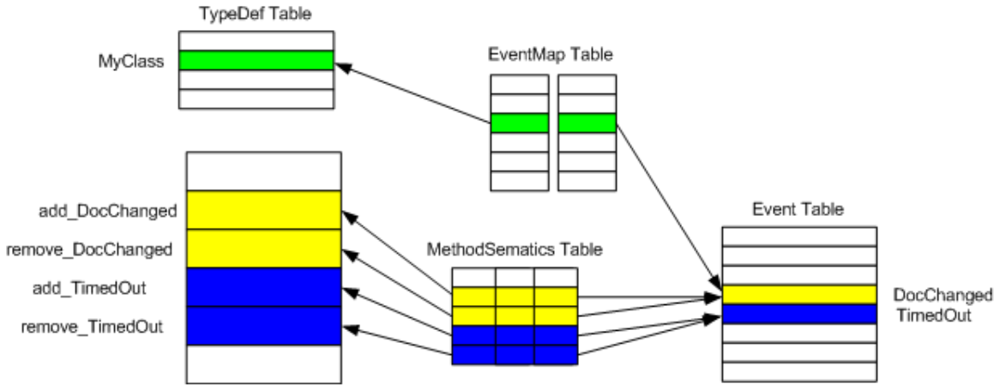

## II.22.13 Event: 0x14

Events are treated within metadata much like Properties; that is, as a way to associate a collection of methods defined on a given class. There are two required methods (`add_` and `remove_`) plus an optional one (`raise_`); additonal methods with other names are also permitted (§[18](#todo-missing-hyperlink)). All of the methods gathered together as an Event shall be defined on the class (§[I.8.11.4](i.8.11.4-event-definitions.md))

The association between a row in the _TypeDef_ table and the collection of methods that make up a given Event is held in three separate tables (exactly analogous to the approach used for Properties), as follows:

 

Row 3 of the _EventMap_ table indexes row 2 of the _TypeDef_ table on the left (`MyClass`), whilst indexing row 4 of the _Event_ table on the right (the row for an Event called `DocChanged`). This setup establishes that `MyClass` has an Event called `DocChanged`. But what methods in the _MethodDef_ table are gathered together as 'belonging' to event `DocChanged`? That association is contained in the _MethodSemantics_ table &mdash; its row 2 indexes event `DocChanged` to the right, and row 2 in the _MethodDef_ table to the left (a method called `add_DocChanged`). Also, row 3 of the _MethodSemantics_ table indexes `DocChanged` to the right, and row 3 in the _MethodDef_ table to the left (a method called `remove_DocChanged`). As the shading suggests, `MyClass` has another event, called `TimedOut`, with two methods, `add_TimedOut` and `remove_TimedOut`.

_Event_ tables do a little more than group together existing rows from other tables. The _Event_ table has columns for _EventFlags_, _Name_ (e.g., `DocChanged` and `TimedOut` in the example here), and _EventType_. In addition, the _MethodSemantics_ table has a column to record whether the method it indexes is an `add_`, a `remove_`, a `raise_`, or other function.

The _Event_ table has the following columns:

 * _EventFlags_ (a 2-byte bitmask of type _EventAttributes_, §[II.23.1.4](ii.23.1.4-flags-for-events-eventattributes.md))

 * _Name_ (an index into the String heap)

 * _EventType_ (an index into a _TypeDef_, a _TypeRef_, or _TypeSpec_ table; more precisely, a _TypeDefOrRef_ (§[II.24.2.6](ii.24.2.6-metadata-stream.md)) coded index) (This corresponds to the Type of the Event; it is not the Type that owns this event.)

Note that _Event_ information does not directly influence runtime behavior; what counts is the information stored for each method that the event comprises. The _EventMap_ and _Event_ tables result from putting the **.event** directive on a class (§[II.18](ii.18-defining-events.md)).

> _This contains informative text only._

 1. The _Event_ table can contain zero or more rows

 2. Each row shall have one, and only one, owner row in the _EventMap_ table \[ERROR\]

 3. _EventFlags_ shall have only those values set that are specified (all combinations valid) \[ERROR\]

 4. _Name_ shall index a non-empty string in the String heap \[ERROR\]

 5. The _Name_ string shall be a valid CLS identifier \[CLS\]

 6. _EventType_ can be null or non-null

 7. If _EventType_ is non-null, then it shall index a valid row in the _TypeDef_ or _TypeRef_ table \[ERROR\]

 8. If _EventType_ is non-null, then the row in the _TypeDef_, _TypeRef_, or _TypeSpec_ table that it indexes shall be a Class (not an Interface or a ValueType) \[ERROR\]

 9. For each row, there shall be one `add_` and one `remove_` row in the _MethodSemantics_ table \[ERROR\]

 10. For each row, there can be zero or one `raise_` row, as well as zero or more other rows in the _MethodSemantics_ table \[ERROR\]

 11. Within the rows owned by a given row in the _TypeDef_ table, there shall be no duplicates based upon _Name_ \[ERROR\]

 12. There shall be no duplicate rows based upon _Name_, where _Name_ fields are compared using CLS conflicting-identifier-rules \[CLS\]

> _End informative text._
