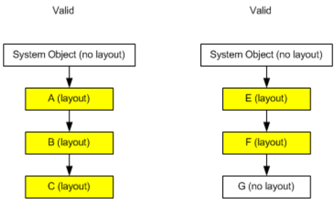
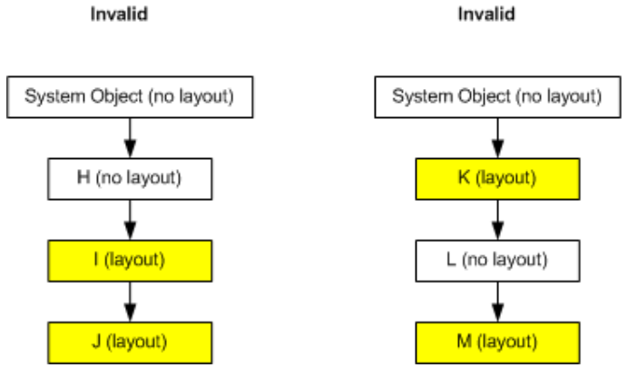
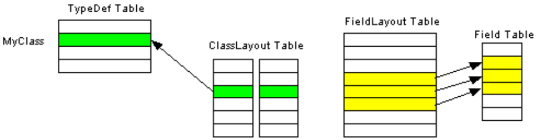

## II.22.8 ClassLayout: 0x0F

The _ClassLayout_ table is used to define how the fields of a class or value type shall be laid out by the CLI. (Normally, the CLI is free to reorder and/or insert gaps between the fields defined for a class or value type.)

_[Rationale:_ This feature is used to lay out a managed value type in exactly the same way as an unmanaged C struct, allowing a managed value type to be handed to unmanaged code, which then accesses the fields exactly as if that block of memory had been laid out by unmanaged code. _end rationale]_

The information held in the _ClassLayout_ table depends upon the _Flags_ value for {`AutoLayout`,`SequentialLayout`, `ExplicitLayout`} in the owner class or value type. A type has layout if it is marked `SequentialLayout` or `ExplicitLayout`. If any type within an inheritance chain has layout, then so shall all its base classes, up to the one that descends immediately from `System.ValueType` (if it exists in the type's hierarchy); otherwise, from `System.Object`.

> _This contains informative text only._

Layout cannot begin part way down the chain. But it is valid to stop "having layout" at any point down the chain. For example, in the diagrams below, Class A derives from `System.Object`; class B derives from A; class C derives from B. `System.Object` has no layout. But A, B and C are all defined with layout, and that is valid.

 

The situation with classes E, F, and G is similar.  G has no layout, and this too is valid. The following picture shows two *invalid* setups: 

 

On the left, the "chain with layout" does not start at the 'highest' class.  And on the right, there is a 'hole' in the "chain with layout".

Layout information for a class or value type is held in two tables (*ClassLayout* and *FieldLayout*), as shown in the following diagram:

 

In this example, row 3 of the _ClassLayout_ table points to row 2 in the _TypeDef_ table (the definition for a Class, called "MyClass"). Rows 4-6 of the _FieldLayout_ table point to corresponding rows in the _Field_ table. This illustrates how the CLI stores the explicit offsets for the three fields that are defined in "MyClass" (there is always one row in the _FieldLayout_ table for each field in the owning class or value type) So, the _ClassLayout_ table acts as an extension to those rows of the _TypeDef_ table that have layout info; since many classes do not have layout info, overall, this design saves space.

> _End informative text._

The _ClassLayout_ table has the following columns:

 * _PackingSize_ (a 2-byte constant)

 * _ClassSize_ (a 4-byte constant)

 * _Parent_ (an index into the _TypeDef_ table)

The rows of the _ClassLayout_ table are defined by placing **.pack** and **.size** directives on the body of the type declaration in which this type is declared (§[II.10.2](ii.10.2-body-of-a-type-definition.md)). When either of these directives is omitted, its corresponding value is zero. (See §[II.10.7](ii.10.7-controlling-instance-layout.md).)

_ClassSize_ of zero does not mean the class has zero size. It means that no **.size** directive was specified at definition time, in which case, the actual size is calculated from the field types, taking account of packing size (default or specified) and natural alignment on the target, runtime platform.

> _This contains informative text only._

 1. A _ClassLayout_ table can contain zero or more rows

 2. _Parent_ shall index a valid row in the _TypeDef_ table, corresponding to a Class or ValueType (but not to an Interface) \[ERROR\]

 3. The Class or ValueType indexed by _Parent_ shall be `SequentialLayout` or `ExplicitLayout` (§[II.23.1.15](ii.23.1.15-flags-for-types-typeattributes.md)). (That is, `AutoLayout` types shall not own any rows in the _ClassLayout_ table.) \[ERROR\]

 4. If _Parent_ indexes a `SequentialLayout` type, then:

    * _PackingSize_ shall be one of {0, 1, 2, 4, 8, 16, 32, 64, 128}. (0 means use the default pack size for the platform on which the application is running.) \[ERROR\]

    * If _Parent_ indexes a ValueType, then _ClassSize_ shall be less than 1 MByte (0x100000 bytes). \[ERROR\]

 5. If _Parent_ indexes an `ExplicitLayout` type, then

    * if _Parent_ indexes a ValueType, then _ClassSize_ shall be less than 1 MByte (0x100000 bytes) \[ERROR\]

    * _PackingSize_ shall be 0. (It makes no sense to provide explicit offsets for each field, as well as a packing size.) \[ERROR\]

 6. Note that an `ExplicitLayout` type might result in a verifiable type, provided the layout does not create a type whose fields overlap.

 7. Layout along the length of an inheritance chain shall follow the rules specified above (starting at 'highest' Type, with no 'holes', etc.) \[ERROR\]

> _End informative text._
