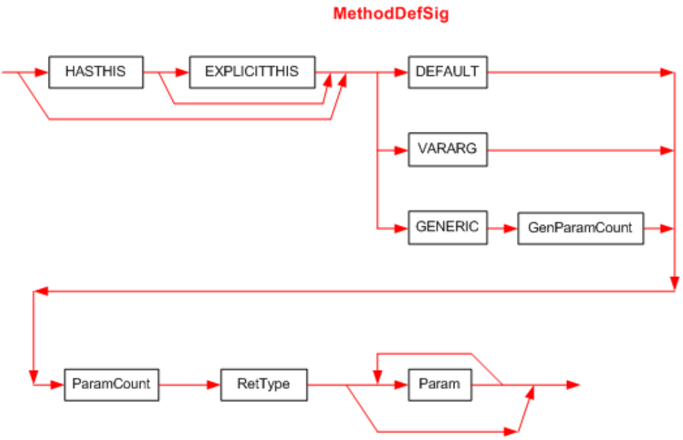

## II.23.2.1 MethodDefSig

A _MethodDefSig_ is indexed by the _Method_._Signature_ column. It captures the signature of a method or global function. The syntax diagram for a _MethodDefSig_ is:

 

This diagram uses the following abbreviations:

 * `HASTHIS` = 0x20, used to encode the keyword **instance** in the calling convention, see §[II.15.3](#todo-missing-hyperlink)

 * `EXPLICITTHIS` = 0x40, used to encode the keyword **explicit** in the calling convention, see §[II.15.3](#todo-missing-hyperlink)

 * `DEFAULT` = 0x0, used to encode the keyword **default** in the calling convention, see §[II.15.3](#todo-missing-hyperlink)

 * `VARARG` = 0x5, used to encode the keyword **vararg** in the calling convention, see §[II.15.3](#todo-missing-hyperlink)

 * `GENERIC` = 0x10, used to indicate that the method has one or more generic parameters.

The first byte of the Signature holds bits for `HASTHIS`, `EXPLICITTHIS` and calling convention (`DEFAULT`, `VARARG`, or `GENERIC`). These are ORed together.

_GenParamCount_ is the number of generic parameters for the method. This is a compressed unsigned integer.

_[Note:_ For generic methods, both _MethodDef_ and _MemberRef_ shall include the `GENERIC` calling convention, together with _GenParamCount_; these are significant for binding&mdash;they enable the CLI to overload on generic methods by the number of generic parameters they include. _end note]_

_ParamCount_ is an unsigned integer that holds the number of parameters (0 or more). It can be any number between 0 and 0x1FFFFFFF.  The compiler compresses it too (see §[15](#todo-missing-hyperlink)) &ndash; before storing into the 'blob' (ParamCount counts just the method parameters &ndash; it does not include the method's return type)

The _RetType_ item describes the type of the method's return value (§[II.23.2.11](#todo-missing-hyperlink))

The _Param_ item describes the type of each of the method's parameters. There shall be _ParamCount_ instances of the _Param_ item (§[II.23.2.10](#todo-missing-hyperlink)).
