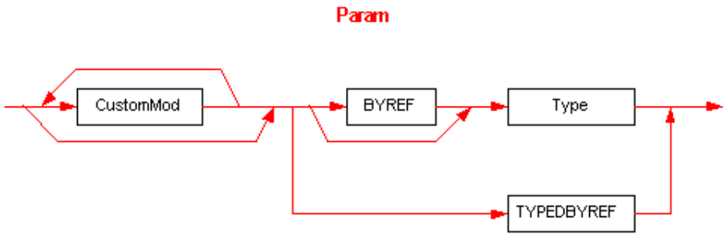

## II.23.2.10 Param

The _Param_ (parameter) item in Signatures has this syntax diagram:

 

This diagram uses the following abbreviations:

 * `BYREF` for 0x10 (§[II.23.1.16](#todo-missing-hyperlink))

 * `TYPEDBYREF` for 0x16 (§[II.23.1.16](#todo-missing-hyperlink))

_CustomMod_ is defined in §[II.23.2.7](#todo-missing-hyperlink)

_Type_ is defined in §[II.23.2.12](#todo-missing-hyperlink).
