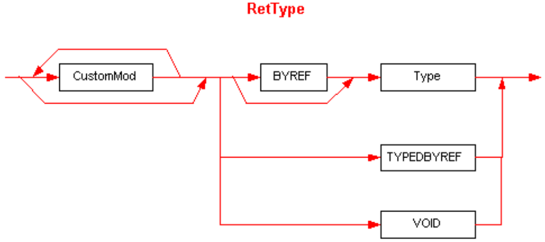

## II.23.2.11 RetType

The _RetType_ (return type) item in Signatures has this syntax diagram:

 

_RetType_ is identical to _Param_ except for one extra possibility, that it can include the type `VOID`.

This diagram uses the following abbreviations:

 * `BYREF` for `ELEMENT_TYPE_BYREF` (§[II.23.1.16](ii.23.1.16-element-types-used-in-signatures.md))

 * `TYPEDBYREF` for `ELEMENT_TYPE_TYPEDBYREF` (§[II.23.1.16](ii.23.1.16-element-types-used-in-signatures.md))

 * `VOID` for `ELEMENT_TYPE_VOID` (§[II.23.1.16](ii.23.1.16-element-types-used-in-signatures.md))
