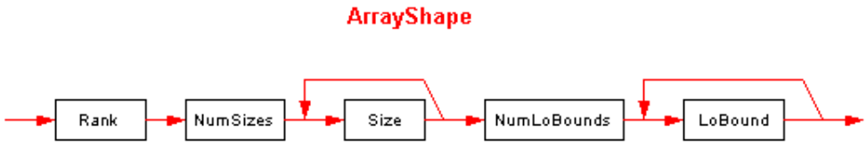

## II.23.2.13 ArrayShape

An _ArrayShape_ has the following syntax diagram:

 

_Rank_ is an unsigned integer (stored in compressed form, see §[II.23.2](ii.23.2-blobs-and-signatures.md)) that specifies the number of dimensions in the array (shall be 1 or more).

_NumSizes_ is a compressed unsigned integer that says how many dimensions have specified sizes (it shall be 0 or more).

_Size_ is a compressed unsigned integer specifying the size of that dimension &ndash; the sequence starts at the first dimension, and goes on for a total of _NumSizes_ items.

Similarly, _NumLoBounds_ is a compressed unsigned integer that says how many dimensions have specified lower bounds (it shall be 0 or more).

And _LoBound_ is a compressed signed integer specifying the lower bound of that dimension &ndash; the sequence starts at the first dimension, and goes on for a total of _NumLoBounds_ items.

None of the dimensions in these two sequences can be skipped, but the number of specified dimensions can be less than _Rank_.

Here are a few examples, all for element type `int32`:

 | &nbsp; | Type | Rank | NumSizes | Size | NumLoBounds | LoBound
 | ---- | ---- | ---- | ---- | ---- | ---- | ----
 | `[0...2]` | `I4` | `1` | `1` | `3` | `0` | &nbsp;
 | [,,,,,,] | `I4` | `7` | `0` | &nbsp; | `0` | &nbsp;
 | `[0...3, 0...2,,,,]` | `I4` | `6` | `2` | `4 3` | `2` | `0 0`
 | `[1...2, 6...8]` | `I4` | `2` | `2` | `2 3` | `2` | `1 6`
 | `[5, 3...5, , ]` | `I4` | `4` | `2` | `5 3` | `2` | `0 3`
 
_[Note:_ definitions can nest, since the Type can itself be an array. _end note]_
