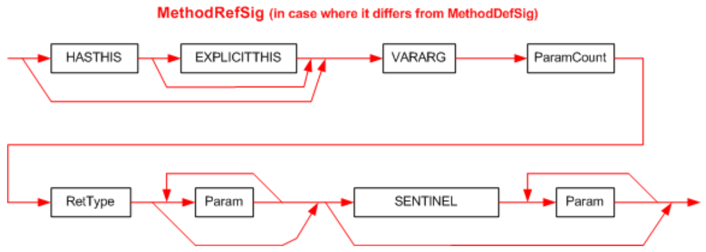

## II.23.2.2 MethodRefSig

A _MethodRefSig_ is indexed by the _MemberRef_._Signature_ column. This provides the *call site* Signature for a method.  Normally, this call site Signature shall match exactly the Signature specified in the definition of the target method.  For example, if a method `Foo` is defined that takes two `unsigned int32`s and returns `void`; then any call site shall index a signature that takes exactly two `unsigned int32`s and returns `void`. In this case, the syntax diagram for a _MethodRefSig_ is identical with that for a _MethodDefSig_ &ndash; see §[II.23.2.1](ii.23.2.1-methoddefsig.md)

The Signature at a call site differs from that at its definition, only for a method with the `VARARG` calling convention. In this case, the call site Signature is extended to include info about the extra `VARARG` arguments (for example, corresponding to the "`...`" in C syntax). The syntax diagram for this case is:

 

This diagram uses the following abbreviations:

 * `HASTHIS` = 0x20, used to encode the keyword **instance** in the calling convention, see §[II.15.3](ii.15.3-calling-convention.md)

 * `EXPLICITTHIS` = 0x40, used to encode the keyword **explicit** in the calling convention, see §[II.15.3](ii.15.3-calling-convention.md)
 
 * `VARARG` = 0x5, used to encode the keyword **vararg** in the calling convention, see §[II.15.3](ii.15.3-calling-convention.md)
 
 * `SENTINEL` = 0x41 (§[II.23.1.16](ii.23.1.16-element-types-used-in-signatures.md)), used to encode "`...`" in the parameter list, see §[II.15.3](ii.15.3-calling-convention.md)

The first byte of the Signature holds bits for `HASTHIS`, `EXPLICITTHIS`, and the calling convention `VARARG`. These are ORed together.

_ParamCount_ is an unsigned integer that holds the number of parameters (0 or more). It can be any number between 0 and 0x1FFFFFFF. The compiler compresses it (see §15) &ndash; before storing into the 'blob' (_ParamCount_ counts just the method parameters &ndash; it does not include the method's return type)

The _RetType_ item describes the type of the method’s return value (§[II.23.2.11](ii.23.2.11-rettype.md))

The _Param_ item describes the type of each of the method's parameters. There shall be _ParamCount_ instances of the _Param_ item (§[II.23.2.10](ii.23.2.10-param.md)).

The _Param_ item describes the type of each of the method's parameters. There shall be _ParamCount_ instances of the _Param_ item. This starts just like the _MethodDefSig_ for a `VARARG` method (§[II.23.2.1](ii.23.2.1-methoddefsig.md)). But then a `SENTINEL` token is appended, followed by extra _Param_ items to describe the extra `VARARG` arguments.  Note that the _ParamCount_ item shall indicate the total number of _Param_ items in the Signature &ndash; before and after the `SENTINEL` byte (0x41).

In the unusual case that a call site supplies no extra arguments, the signature shall not include a `SENTINEL` (this is the route shown by the lower arrow that bypasses `SENTINEL` and goes to the end of the _MethodRefSig_ definition).
