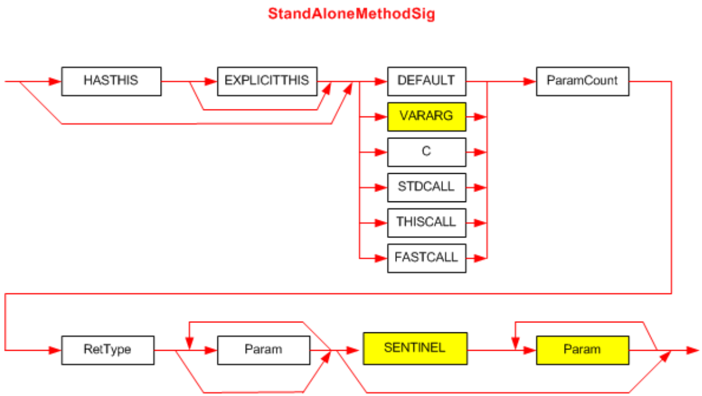

## II.23.2.3 StandAloneMethodSig

A _StandAloneMethodSig_ is indexed by the _StandAloneSig_._Signature_ column. It is typically created as preparation for executing a `calli` instruction. It is similar to a _MethodRefSig_, in that it represents a call site signature, but its calling convention can specify an unmanaged target (the `calli` instruction invokes either managed, or unmanaged code). Its syntax diagram is: 

 

This diagram uses the following abbreviations (§[II.15.3](#todo-missing-hyperlink)):

 * `HASTHIS` for 0x20
 * `EXPLICITTHIS` for 0x40
 * `DEFAULT` for 0x0
 * `VARARG` for 0x5
 * `C` for 0x1
 * `STDCALL` for 0x2
 * `THISCALL` for 0x3
 * `FASTCALL` for 0x4
 * `SENTINEL` for 0x41 (§[II.23.1.16](#todo-missing-hyperlink) and §[II.15.3](#todo-missing-hyperlink))

The first byte of the Signature holds bits for `HASTHIS`, `EXPLICITTHIS` and calling convention &ndash; `DEFAULT`, `VARARG`, `C`, `STDCALL`, `THISCALL`, or `FASTCALL`. These are OR'd together.

_ParamCount_ is an unsigned integer that holds the number of non-vararg and vararg parameters, combined. It can be any number between 0 and 0x1FFFFFFF. The compiler compresses it (see §[15](#todo-missing-hyperlink)) &ndash; before storing into the blob (_ParamCount_ counts just the method parameters &ndash; it does not include the method's return type)

The _RetType_ item describes the type of the method's return value (§[II.23.2.11](#todo-missing-hyperlink)) 

The first _Param_ item describes the type of each of the method's non-vararg parameters. The (optional) second _Param_ item describes the type of each of the method's vararg parameters. There shall be _ParamCount_ instances of _Param_ (§[II.23.2.10](#todo-missing-hyperlink)).

This is the most complex of the various method signatures. Two separate diagrams have been combined into one in this diagram, using shading to distinguish between them. Thus, for the following calling conventions: `DEFAULT` (managed), `STDCALL`, `THISCALL` and `FASTCALL` (unmanaged), the signature ends just before the `SENTINEL` item (these are all non vararg signatures). However, for the managed and unmanaged vararg calling conventions:

`VARARG` (managed) and `C` (unmanaged), the signature can include the SENTINEL and final _Param_ items (they are not required, however). These options are indicated by the shading of boxes in the syntax diagram.

In the unusual case that a call site supplies no extra arguments, the signature shall not include a `SENTINEL` (this is the route shown by the lower arrow that bypasses `SENTINEL` and goes to the end of the _StandAloneMethodSig_ definition).
