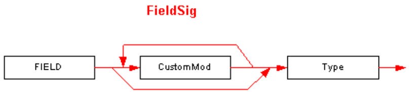

## II.23.2.4 FieldSig

A _FieldSig_ is indexed by the _Field_._Signature_ column, or by the _MemberRef_._Signature_ column (in the case where it specifies a reference to a field, not a method, of course). The Signature captures the field's definition. The field can be a static or instance field in a class, or it can be a global variable. The syntax diagram for a _FieldSig_ looks like this:

 

This diagram uses the following abbreviations:

 * `FIELD` for 0x6

_CustomMod_ is defined in §[II.23.2.7](#todo-missing-hyperlink). _Type_ is defined in §[II.23.2.12](ii.23.2.12-type.md).
