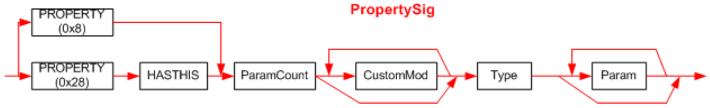

## II.23.2.5 PropertySig

A _PropertySig_ is indexed by the _Property_._Type_ column. It captures the type information for a Property &ndash; essentially, the signature of its _getter_ method:

 * the number of parameters supplied to its *getter* method

 * the base type of the Property (the type returned by its _getter_ method)
 
 * type information for each parameter in the *getter* method (that is, the index parameters)

Note that the signatures of getter and setter are related precisely as follows:

 * The types of a *getter*'s _ParamCount_ parameters are exactly the same as the first _ParamCount_ parameters of the setter

 * The return type of a *getter* is exactly the same as the type of the last parameter supplied to the *setter*

The syntax diagram for a _PropertySig_ looks like this:

 

The first byte of the Signature holds bits for `HASTHIS` and `PROPERTY`. These are OR’d together.

_Type_ specifies the type returned by the *getter* method for this property. _Type_ is defined in §[II.23.2.12](ii.23.2.12-type.md).

_Param_ is defined in §[II.23.2.10](#todo-missing-hyperlink).

_ParamCount_ is a compressed unsigned integer that holds the number of index parameters in the getter methods (0 or more). (§[II.23.2.1](#todo-missing-hyperlink)) (_ParamCount_ counts just the method parameters &ndash; it does not include the method's base type of the Property)
