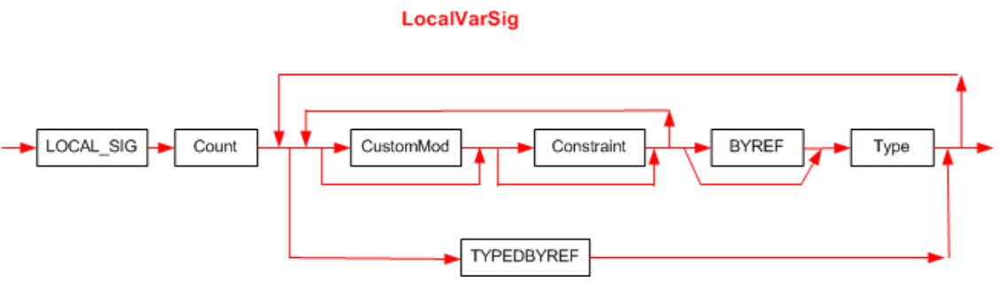

## II.23.2.6 LocalVarSig

A _LocalVarSig_ is indexed by the _StandAloneSig_._Signature_ column. It captures the type of all the local variables in a method. Its syntax diagram is:

 

This diagram uses the following abbreviations:

 * `LOCAL_SIG` for 0x7, used for the **.locals** directive, see §[II.15.4.1.3](#todo-missing-hyperlink)

 * `BYREF` for `ELEMENT_TYPE_BYREF` (§[II.23.1.16](#todo-missing-hyperlink))

_Constraint_ is defined in §[II.23.2.9](#todo-missing-hyperlink).

_Type_ is defined in §[II.23.2.12](#todo-missing-hyperlink)

_Count_ is a compressed unsigned integer that holds the number of local variables. It can be any number between 1 and 0xFFFE.

There shall be _Count_ instances of the _Type_ in the _LocalVarSig_
