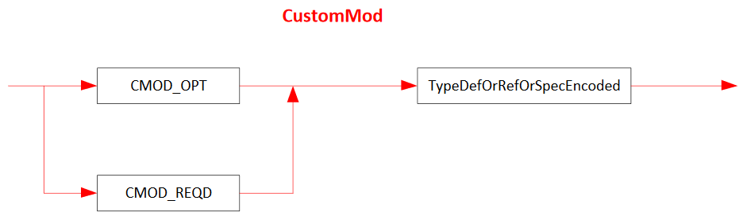

## II.23.2.7 CustomMod

The _CustomMod_ (custom modifier) item in Signatures has a syntax diagram like this:

 

This diagram uses the following abbreviations:

 * `CMOD_OPT` for `ELEMENT_TYPE_CMOD_OPT` (§[II.23.1.16](ii.23.1.16-element-types-used-in-signatures.md))

 * `CMOD_REQD` for `ELEMENT_TYPE_CMOD_REQD` (§[II.23.1.16](ii.23.1.16-element-types-used-in-signatures.md))

The `CMOD_OPT` or `CMOD_REQD` value is compressed, see §[II.23.2](ii.23.2-blobs-and-signatures.md).

The `CMOD_OPT` or `CMOD_REQD` is followed by a metadata token that indexes a row in the _TypeDef_ table or the _TypeRef_ table. However, these tokens are encoded and compressed &ndash; see §[II.23.2.8](ii.23.2.8-typedeforreforspecencoded.md) for details

If the CustomModifier is tagged `CMOD_OPT`, then any importing compiler can freely ignore it entirely. Conversely, if the CustomModifier is tagged `CMOD_REQD`, any importing compiler shall 'understand' the semantic implied by this CustomModifier in order to reference the surrounding Signature.
