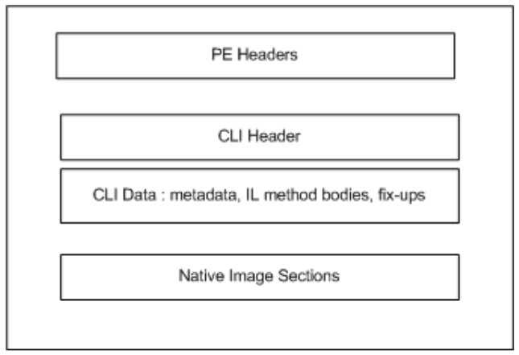

## II.25.1 Structure of the runtime file format

The figure below provides a high-level view of the CLI file format. All runtime images contain the following:

 * PE headers, with specific guidelines on how field values should be set in a runtime file.

 * A CLI header that contains all of the runtime specific data entries. The runtime header is read-only and shall be placed in any read-only section.

 * The sections that contain the actual data as described by the headers, including imports/exports, data, and code.

 

The CLI header (§[II.25.3.3](#todo-missing-hyperlink)) is found using CLI Header directory entry in the PE header. The CLI header in turn contains the address and sizes of the runtime data (for metadata, see §[II.24](#todo-missing-hyperlink); for CIL see §[II.25.4](#todo-missing-hyperlink)) in the rest of the image. Note that the runtime data can be merged into other areas of the PE format with the other data based on the attributes of the sections (such as read only versus execute, etc.).
