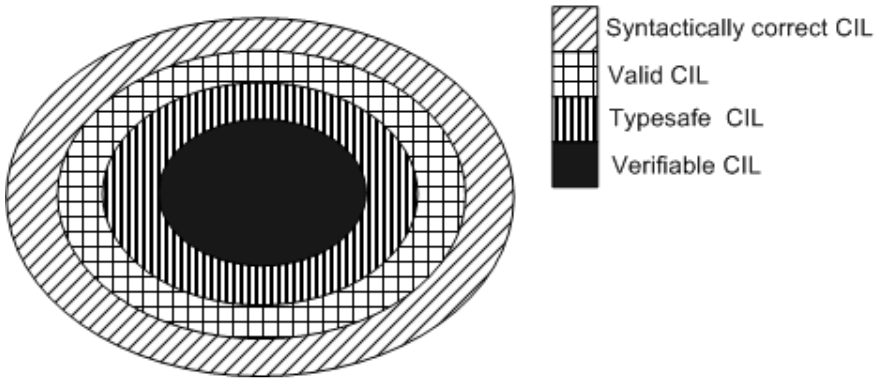

## II.3 Validation and verification

*Validation* refers to the application of a set of tests on any file to check that the file’s format, metadata, and CIL are self-consistent. These tests are intended to ensure that the file conforms to the normative requirements of this specification. When a conforming implementation of the CLI is presented with a non-conforming file, the behavior is unspecified.

*Verification* refers to the checking of both CIL and its related metadata to ensure that the CIL code sequences do not permit any access to memory outside the program's logical address space. In conjunction with the validation tests, verification ensures that the program cannot access memory or other resources to which it is not granted access.

[Partition III](#todo-missing-hyperlink) specifies the rules for both correct and verifiable use of CIL instructions. [Partition III](#todo-missing-hyperlink) also provides an informative description of rules for validating the internal consistency of metadata (the rules follow, albeit indirectly, from the specification in this Partition); it also contains a normative description of the verification algorithm. A mathematical proof of soundness of the underlying type system is possible, and provides the basis for the verification requirements. Aside from these rules, this standard leaves as unspecified:

 * The time at which (if ever) such an algorithm should be performed. 

 * What a conforming implementation should do in the event of a verification failure.

The following figure makes this relationship clearer (see next paragraph for a description):

#### Figure 1: Relationship between correct and verifiable CIL

 

In the above figure, the outer circle contains all code permitted by the ILAsm syntax. The next inner circle represents all code that is correct CIL. The striped inner circle represents all type-safe code. Finally, the black innermost circle contains all code that is verifiable. (The difference between type-safe code and verifiable code is one of *provability*: code which passes the VES verification algorithm is, by-definition, *verifiable*; but that simple algorithm rejects certain code, even though a deeper analysis would reveal it as genuinely type-safe). Note that even if a program follows the syntax described in [Partition VI](#todo-missing-hyperlink), the code might still not be valid, because valid code shall adhere to restrictions presented in this Partition and in [Partition III](#todo-missing-hyperlink).

The verification process is very stringent. There are many programs that will pass validation, but will fail verification. The VES cannot guarantee that these programs do not access memory or resources to which they are not granted access. Nonetheless, they might have been correctly constructed so that they do not access these resources. It is thus a matter of trust, rather than mathematical proof, whether it is safe to run these programs. Ordinarily, a conforming implementation of the CLI can allow *unverifiable code* (valid code that does not pass verification) to be executed, although this can be subject to administrative trust controls that are not part of this standard. A conforming implementation of the CLI shall allow the execution of verifiable code, although this can be subject to additional implementation-specified trust controls.

