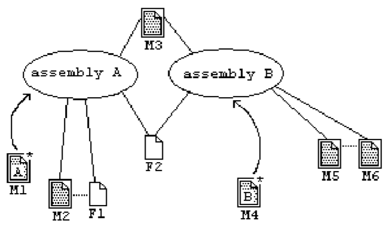

## II.6.1 Overview of modules, assemblies, and files

> _This subclause contains informative text only._

Consider the following figure:

#### Figure 2: References to Modules and Files

 

Eight files are shown, each with its name written below it. The six files that each declare a module have an additional border around them, and their names begin with _M_. The other two files have a name beginning with _F_. These files can be resource files (such as bitmaps) or other files that do not contain CIL code.

Files _M1_ and _M4_ declare an assembly in addition to the module declaration, namely assemblies _A_ and _B_, respectively. The assembly declaration in _M1_ and _M4_ references other modules, shown with straight lines. For example, assembly _A_ references _M2_ and _M3_, and assembly _B_ references _M3_ and _M5_. Thus, both assemblies reference _M3_.

Usually, a module belongs only to one assembly, but it is possible to share it across assemblies. When assembly _A_ is loaded at runtime, an instance of _M3_ will be loaded for it. When assembly _B_ is loaded into the same application domain, possibly simultaneously with assembly _A_, _M3_ will be shared for both assemblies. Both assemblies also reference _F2_, for which similar rules apply.

The module _M2_ references _F1_, shown by dotted lines. As a consequence, _F1_ will be loaded as part of assembly _A_, when _A_ is executed. Thus, the file reference shall also appear with the assembly declaration. Similarly, _M5_ references another module, _M6_, which becomes part of _B_ when _B_ is executed. It follows that assembly _B_ shall also have a module reference to _M6_.

> _End informative text._
