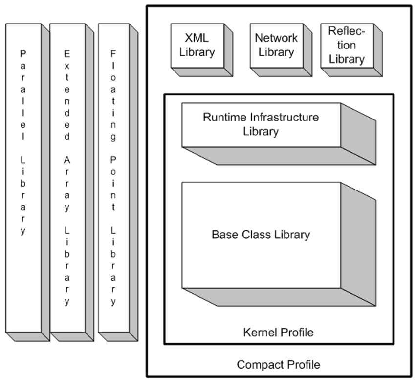

## IV.2.3 The relationship between Libraries and Profiles

This standard specifies two Standard Profiles (§[IV.3](iv.3-the-standard-profiles.md)) and seven Standard Libraries (§[IV.5](iv.5-the-standard-libraries.md)). The following diagram shows the relationship between the Libraries and the Profiles:

 

The Extended Array and Extended Numerics Libraries are not part of either Profile, but can be combined with either of them. Doing so adds the appropriate methods, exceptions, and interfaces to the types specified in the Profile.
